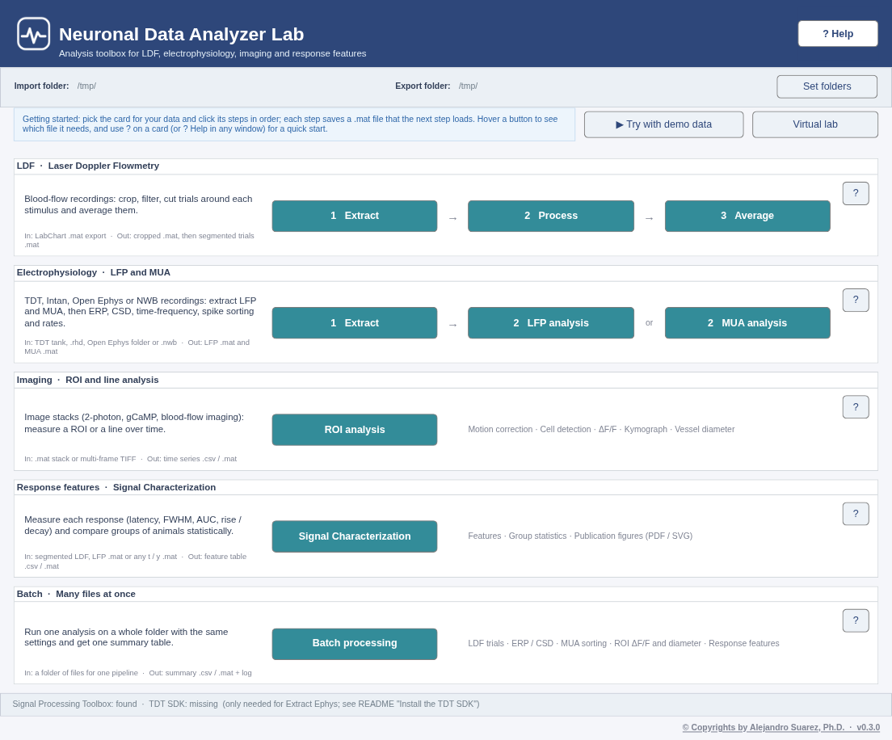

# NeuronalDataAnalyzerLab

[](CHANGELOG.md)
[](LICENSE.txt)
[](https://www.mathworks.com/products/matlab.html)

> **Install via [Releases](https://github.com/alesuarez92/NeuronalDataAnalyzerLab/releases/latest)**,
> not the green *Code → Download ZIP* button at the top of this page.
> The green button gives you the in-development `main` branch; the
> Releases page gives you a tagged, tested version (currently
> [v0.3.0](https://github.com/alesuarez92/NeuronalDataAnalyzerLab/releases/tag/v0.3.0)).
> Full walk-through below in [Install](#install).



Neuroscience analysis toolbox for **Laser Doppler Flowmetry**,
**electrophysiology** (LFP: ERP, CSD, time–frequency; MUA: spike detection,
sorting with cluster merge/split, raster/PSTH, correlograms; TDT, Intan,
Open Ephys and NWB recordings), **ROI / coregistered image analysis**
(motion correction, multiple ROIs, cell detection, ΔF/F, kymograph,
robust vessel diameter), **histology and culture images** (cell counts,
marker-positive cells, counts per region and per mm², section and time-point
alignment), and **signal characterization**
(response features, group statistics, publication figures).

Every analysis can run on a whole folder (**batch processing**), be saved
and reopened as a **session** with input-file checksums, and produce a
one-page **PDF report** and a draft **methods text** (every step and
parameter, software versions and references, ready to edit). Every window has **synthetic demo data with known
answers**, so results can be checked before using real recordings.

To learn by doing, the **Virtual lab** lets a student plan and record a
simulated experiment (LDF with whisker stimulation), analyse it from
scratch in the normal windows and get feedback on the plan, the processing
and the results; instructors can grade a folder of submissions.

> **Status: early release (v0.3.0).** The UI works end-to-end on the lab's
> data formats, but the public surface is not yet stable. See
> [CHANGELOG.md](CHANGELOG.md) for what's in this release and what's next.

## Use this as a toolbox

This repo is meant to be **installed and used in place**, not cloned and
republished. The license ([LICENSE.txt](LICENSE.txt)) reserves all rights —
in particular, modifying, redistributing, or republishing this code under a
different name is not permitted without written permission.

If you find a bug or want a feature: **file an issue or open a PR back to
this repo.** See [CONTRIBUTING.md](CONTRIBUTING.md). Don't maintain a
long-running fork.

If you use the tool in published research, please cite it — GitHub renders
a "Cite this repository" button from [CITATION.cff](CITATION.cff).

## Install

1. **Download the release ZIP** from
   [Releases](https://github.com/alesuarez92/NeuronalDataAnalyzerLab/releases)
   (pick the latest, click *Source code (zip)*).
2. **Unzip** it somewhere stable, e.g.
   `~/Documents/MATLAB/NeuronalDataAnalyzerLab`.
3. **Add to path** (one time): in MATLAB,
   ```matlab
   addpath(genpath('~/Documents/MATLAB/NeuronalDataAnalyzerLab'));
   savepath;   % optional: persist for future sessions
   ```
4. **Launch** from the Command Window:
   ```matlab
   NeuroAnalyzer
   ```

To upgrade to a newer release: download the new ZIP, replace the folder
contents (path stays the same), and re-launch. A `.mltbx` toolbox installer
is planned for a later release so this becomes one click.

If you'd rather track development directly:
`git clone https://github.com/alesuarez92/NeuronalDataAnalyzerLab.git`
into the same location. Just don't push your changes to a fork — open
issues / PRs back to this repo instead. See [CONTRIBUTING.md](CONTRIBUTING.md).

## Structure

| Path | Contents |
| --- | --- |
| `NeuroAnalyzer.m` | Entry point; run this to open the launcher. |
| `core/` | `Main.m` launcher, `UITheme`, project-path manager, data loader, validation, processing, signal-feature library. |
| `core/imaging/` | ROI / line-based image analysis: ΔF/F, kymograph, vessel diameter, intensity, movement, motion correction, cell detection. |
| `core/Histology.m` | Still images of sections and cultures: loading with pixel size, channel and image alignment, cell counting, marker co-localisation, counts per region. |
| `core/io/` | Readers for Intan RHD, Open Ephys binary and NWB; NWB export. |
| `core/demo/`, `core/DemoData.m` | Synthetic demo recordings with ground truth. |
| `core/Batch.m`, `core/Session.m`, `core/Report.m`, `core/MethodsWriter.m` | Batch processing, session files, PDF reports, methods text. |
| `core/VirtualLab.m` | Virtual lab: simulated experiments with known answers, reference analysis and feedback. |
| `apps/` | Sub-app windows: Extract / Process / Average LDF, Extract Ephys, LFP & MUA processing and analysis, ROI Analysis, Histology / culture, Signal Characterization, Batch Processing, Virtual Lab, Help. |
| `docs/` | Workflow and principle figures shown in the Help window. |
| `tests/` | Unit tests. Run via `run_tests`. |
| `Utilities/` | Third-party utilities (e.g. TDT MATLAB SDK). |

## Requirements

- MATLAB **R2021a or later** (uses `uifigure`, `uigridlayout`, `uihyperlink`).
- For TDT data: the **TDT MATLAB SDK** under `Utilities/TDTMatlabSDK/`.
  See [Install the TDT SDK](#install-the-tdt-sdk) below.

## Install the TDT SDK

The Tucker-Davis Technologies MATLAB SDK is a separate, third-party
toolbox required only for loading TDT tank data (`Extract Ephys Data`).
It has its own license and is not redistributed in this repo.

1. Download the SDK from TDT:
   [tdt.com/support/matlab-sdk](https://www.tdt.com/support/matlab-sdk/).
2. Unzip the archive.
3. Place the resulting `TDTMatlabSDK/` folder under `Utilities/` so the
   layout is:

   ```text
   NeuronalDataAnalyzerLab/
   └── Utilities/
       └── TDTMatlabSDK/
           ├── TDTSDK/
           ├── Examples/
           └── ...
   ```

4. Re-launch MATLAB (the SDK is added to the path automatically by
   `ExtractEphysApp` when needed).

`Utilities/TDTMatlabSDK/` is `.gitignore`d, so this folder lives on your
machine only — no need to remove it before pulling updates.

If you don't process TDT data, you can skip this step entirely; the rest
of the toolbox (LDF, ROI imaging, signal characterization) works without
the SDK.

## Development

- **Tests:** run `run_tests` from the project root, or `runtests('tests')`.
  See [tests/README.md](tests/README.md). CI runs code analysis and the
  tests on every push ([.github/workflows/ci.yml](.github/workflows/ci.yml)).
- **Versioning:** semver, single source of truth in `core/UITheme.version`.
  Each release is tagged (`v0.3.0`, ...); pushing the tag runs
  [release.yml](.github/workflows/release.yml), which publishes the GitHub
  Release with that version's CHANGELOG section as notes and recorded in
  [CHANGELOG.md](CHANGELOG.md).
- **Contributing:** see [CONTRIBUTING.md](CONTRIBUTING.md).
- **Roadmap:** planned work and open items for contributors are in
  [ROADMAP.md](ROADMAP.md).

## Author

© Copyrights by Alejandro Suarez, Ph.D. · [GitHub](https://github.com/alesuarez92)
