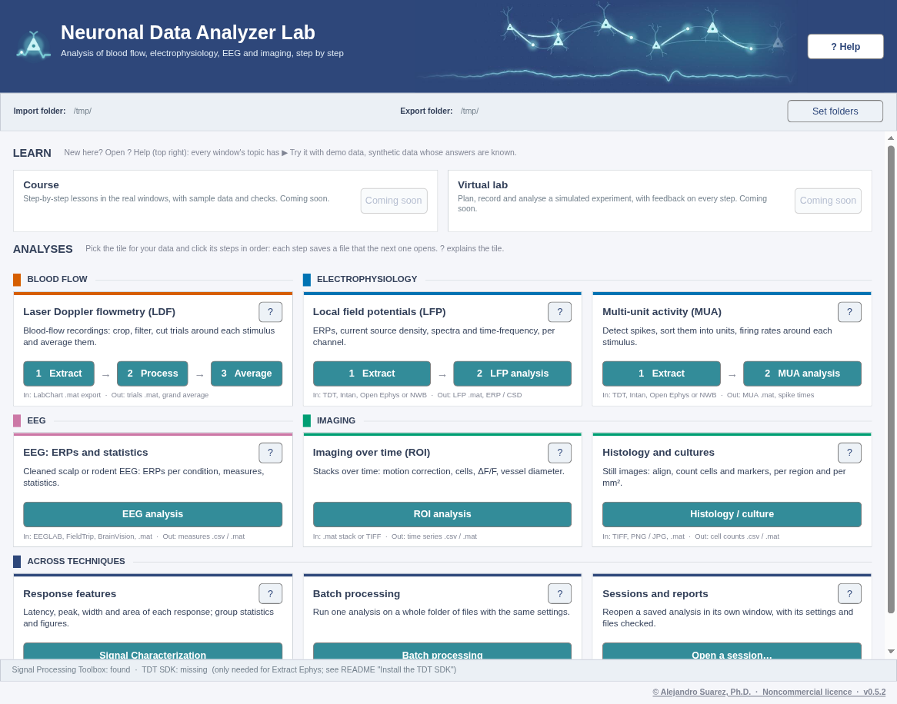

# Neuronal Data Analyzer Lab

[](CHANGELOG.md)
[](LICENSE.txt)
[](https://www.mathworks.com/products/matlab.html)

> **Install via [Releases](https://github.com/alesuarez92/NeuronalDataAnalyzerLab/releases/latest)**,
> not the green *Code → Download ZIP* button at the top of this page.
> The green button gives you the in-development `main` branch; the
> Releases page gives you a tagged, tested version (currently
> [v0.5.1](https://github.com/alesuarez92/NeuronalDataAnalyzerLab/releases/tag/v0.5.1)).
> Full walk-through below in [Install](#install).



Neuroscience analysis toolbox for **Laser Doppler Flowmetry**,
**electrophysiology** (LFP: ERP, CSD, time–frequency; MUA: spike detection,
sorting with cluster merge/split, raster/PSTH, correlograms; TDT, Intan,
Open Ephys and NWB recordings), **ROI / coregistered image analysis**
(motion correction, multiple ROIs, cell detection, ΔF/F, kymograph,
robust vessel diameter), **histology and culture images** (cell counts,
marker-positive cells, counts per region and per mm², section and time-point
alignment), and **signal characterization**
(response features, group statistics, publication figures).

Every analysis can run on a whole folder (**batch processing**), be saved
and reopened as a **session** with input-file checksums, and produce a
one-page **PDF report** and a draft **methods text** (every step and
parameter, software versions and references, ready to edit). Every window has **synthetic demo data with known
answers**, so results can be checked before using real recordings.

Everything needed to learn the tool is free: the in-app **Help** explains
every window step by step, and its *Try it with demo data* button opens
any window with synthetic data whose answers are known; the
[project website](https://neuroanalyzerlab.com) has a guide and walkthroughs.

> **Status: early release (v0.5.1).** The UI works end-to-end on the lab's
> data formats, but the public surface is not yet stable. See
> [CHANGELOG.md](CHANGELOG.md) for what's in this release and what's next.

## Licence and use

Neuronal Data Analyzer Lab is free for **noncommercial use** under the
**PolyForm Noncommercial License 1.0.0** with a **citation condition**
([LICENSE.txt](LICENSE.txt)). In plain words:

- **Free** for research and teaching at universities, public research
  institutes, hospitals, charities and government bodies, and for personal
  study. You may use it, change it and share it for these purposes; keep
  the licence file with every copy.
- **Not for commercial use** (selling it, building it into a product,
  offering it as a paid service) without a separate licence from the
  author: open an issue to ask.
- **Cite it** when you publish or present work that used it: see
  [How to cite](#how-to-cite) and [CITATION.cff](CITATION.cff).

It is research software, not a medical device, and comes with no warranty:
check your results with the demo data first.

The easiest way to use it is to **install a release and use it in place**.
If you find a bug or want a feature, **file an issue or open a PR back to
this repo** (see [CONTRIBUTING.md](CONTRIBUTING.md)), so the fix reaches
every user.

If you use the tool in published research, please cite it — GitHub renders
a "Cite this repository" button from [CITATION.cff](CITATION.cff).

## Install

1. **Download the release ZIP** from
   [Releases](https://github.com/alesuarez92/NeuronalDataAnalyzerLab/releases)
   (pick the latest, click *Source code (zip)*).
2. **Unzip** it somewhere stable, e.g.
   `~/Documents/MATLAB/NeuronalDataAnalyzerLab`.
3. **Add to path** (one time): in MATLAB,
   ```matlab
   addpath(genpath('~/Documents/MATLAB/NeuronalDataAnalyzerLab'));
   savepath;   % optional: persist for future sessions
   ```
4. **Launch** from the Command Window:
   ```matlab
   NeuroAnalyzerLab
   ```

   The launcher opens. New here? Click **? Help** (top right), pick a
   window and click *Try it with demo data*. For your own data, find its tile under
   **Analyses** and click the numbered steps in order; each tile's **?**
   explains it.

To upgrade to a newer release: download the new ZIP, replace the folder
contents (path stays the same), and re-launch. A `.mltbx` toolbox installer
is planned for a later release so this becomes one click.

If you'd rather track development directly:
`git clone https://github.com/alesuarez92/NeuronalDataAnalyzerLab.git`
into the same location. Just don't push your changes to a fork — open
issues / PRs back to this repo instead. See [CONTRIBUTING.md](CONTRIBUTING.md).

## Structure

| Path | Contents |
| --- | --- |
| `NeuroAnalyzerLab.m` | Entry point; run this to open the launcher. |
| `core/` | `Main.m` launcher (tiles from `Techniques.m`, the table of every analysis window), `UITheme`, project-path manager, data loader, validation, processing, signal-feature library. |
| `core/imaging/` | ROI / line-based image analysis: ΔF/F, kymograph, vessel diameter, intensity, movement, motion correction, cell detection. |
| `core/Histology.m` | Still images of sections and cultures: loading with pixel size, channel and image alignment, cell counting, marker co-localisation, counts per region. |
| `core/io/` | Readers and writers for Intan RHD, Open Ephys binary, NWB, NumPy .npy, and EEG files (BrainVision, EEGLAB, FieldTrip, plain matrices). |
| `core/demo/`, `core/DemoData.m` | Synthetic demo recordings with ground truth. |
| `core/Batch.m`, `core/Session.m`, `core/Report.m`, `core/MethodsWriter.m` | Batch processing, session files, PDF reports, methods text. |
| `apps/` | Sub-app windows: Extract / Process / Average LDF, Extract Ephys, LFP & MUA processing and analysis, EEG Analysis, ROI Analysis, Histology / culture, Signal Characterization, Batch Processing, Help. |
| `docs/` | Workflow and principle figures shown in the Help window. |
| `tests/` | Unit tests. Run via `run_tests`. |
| `Utilities/` | Third-party utilities (e.g. TDT MATLAB SDK). |

## Requirements

- MATLAB **R2021a or later** (uses `uifigure`, `uigridlayout`, `uihyperlink`).
- **Signal Processing Toolbox**: filtering, downsampling and spike detection
  (LDF Process, Extract Ephys, MUA analysis).
- **Statistics and Machine Learning Toolbox**: spike sorting (PCA, k-means)
  in MUA analysis. Group statistics, EEG and histology need no toolbox.
- **Image Processing Toolbox**: drawing a ROI or a line in ROI analysis.
- For TDT data: the **TDT MATLAB SDK** under `Utilities/TDTMatlabSDK/`.
  See [Install the TDT SDK](#install-the-tdt-sdk) below.

## Install the TDT SDK

The Tucker-Davis Technologies MATLAB SDK is a separate, third-party
toolbox required only for loading TDT tank data (`Extract Ephys Data`).
It has its own license and is not redistributed in this repo.

1. Download the SDK from TDT:
   [tdt.com/support/matlab-sdk](https://www.tdt.com/support/matlab-sdk/).
2. Unzip the archive.
3. Place the resulting `TDTMatlabSDK/` folder under `Utilities/` so the
   layout is:

   ```text
   NeuronalDataAnalyzerLab/
   └── Utilities/
       └── TDTMatlabSDK/
           ├── TDTSDK/
           ├── Examples/
           └── ...
   ```

4. Re-launch MATLAB (the SDK is added to the path automatically by
   `ExtractEphysApp` when needed).

`Utilities/TDTMatlabSDK/` is `.gitignore`d, so this folder lives on your
machine only — no need to remove it before pulling updates.

If you don't process TDT data, you can skip this step entirely; the rest
of the toolbox (LDF, EEG, ROI imaging, histology, signal characterization) works without
the SDK.

## Development

- **Tests:** run `run_tests` from the project root, or `runtests('tests')`.
  See [tests/README.md](tests/README.md). CI runs code analysis and the
  tests on every push ([.github/workflows/ci.yml](.github/workflows/ci.yml)).
- **Versioning:** semver, single source of truth in `core/UITheme.version`.
  Each release is tagged (`v0.4.0`, ...); pushing the tag runs
  [release.yml](.github/workflows/release.yml), which publishes the GitHub
  Release with that version's CHANGELOG section as notes and recorded in
  [CHANGELOG.md](CHANGELOG.md).
- **Contributing:** see [CONTRIBUTING.md](CONTRIBUTING.md).
- **Roadmap:** planned work and open items for contributors are in
  [ROADMAP.md](ROADMAP.md).

## Community

- **Questions and discussion**: [GitHub Discussions](https://github.com/alesuarez92/NeuronalDataAnalyzerLab/discussions)
  ("how do I…", "which setting…", and *Show and tell* for how you use it).
- **Report a problem**: [bug report](https://github.com/alesuarez92/NeuronalDataAnalyzerLab/issues/new?template=bug_report.yml).
- **An explanation that is unclear or wrong** (Help, the website, a message):
  [tell us where](https://github.com/alesuarez92/NeuronalDataAnalyzerLab/issues/new?template=explanation.yml).
- **Request a technique or feature**: [feature request](https://github.com/alesuarez92/NeuronalDataAnalyzerLab/issues/new?template=feature_request.yml).
- **Follow new releases**: **Watch → Custom → Releases** on this page, or the
  [releases feed](https://github.com/alesuarez92/NeuronalDataAnalyzerLab/releases.atom).

The website has the same on its Community page (About → Community).

## How to cite

If you use Neuronal Data Analyzer Lab, or results produced with it, in work
that you publish or present, cite it (this is a condition of the licence):

> Suarez, A. (2026). *Neuronal Data Analyzer Lab* (version 0.5.1) [Computer
> software]. https://github.com/alesuarez92/NeuronalDataAnalyzerLab

GitHub's **Cite this repository** button (right-hand column) gives the same
citation in APA and BibTeX, from [CITATION.cff](CITATION.cff). In a methods
section, also name the version you used and the settings you chose.

## Author

© 2026 Alejandro Suarez, Ph.D. · [ORCID](https://orcid.org/0000-0002-0931-8512) · [GitHub](https://github.com/alesuarez92) · licensed under the [PolyForm Noncommercial License 1.0.0 with a citation condition](LICENSE.txt)

Neuronal Data Analyzer Lab was developed with the assistance of **Claude** (Anthropic),
an AI model, used through Claude Code. The author designs and directs the
work, reviews what is produced and is responsible for the content. If you
find an error, please report it in [GitHub issues](https://github.com/alesuarez92/NeuronalDataAnalyzerLab/issues).
